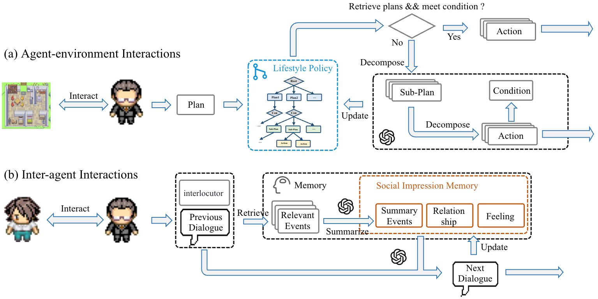

# Affordable Generative Agents

"Affordable Generative Agents (AGA)" is a framework for enabling the generation of believable and low-cost agent-environment and inter-agent interactions. In this repository, we support two environments:

- GA: [Generative Agents: Interactive Simulacra of Human Behavior](https://github.com/joonspk-research/generative_agents)
- VirtualHome: [VirtualHome](https://github.com/xavierpuigf/virtualhome)
