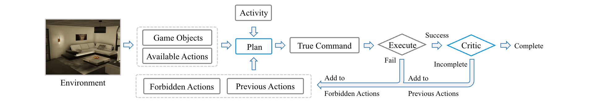

# AGA in VirtualHome

<p align="center" width="100%">



</p>

This work is based on [VirtualHome](https://github.com/xavierpuigf/virtualhome). VirtualHome provides a platform that simulates a 3D household environment. For more detailed information about the platform, please refer to [VirtualHome](https://github.com/xavierpuigf/virtualhome).

## Preparation
To set up your environment, you will need to generate a `utils.py` file that contains your LLM API key, install dependencies and download the VirtualHome simulator.

### Step 1. Generate Utils File
In the `VirtualHome` folder (where `main.py` is located), create a new file titled `utils.py` and copy and paste the content below into the file, we offer Azure API, OpenAI API and llama version (you should specify the `key_type`):
```python
key_type = 'azure'
assert key_type in ['openai', 'azure', 'llama'], "ERROR: wrong key type, the key type should select from ['openai', " \
                                                 "'azure', 'llama']. "
# openai
openai_api_key = "<Your OpenAI API>"
key_owner = "<Name>"

# azure
if key_type == 'azure':
    openai_api_key = "<Your Azure API Key>"
    openai_api_base = "<Your Azure API Base>"  # your endpoint should look like the following https://YOUR_RESOURCE_NAME.openai.azure.com/
    openai_api_type = 'azure'
    openai_api_version = '2023-05-15'  # this may change in the future
    # for completion
    openai_completion_api_key = "<Your Azure API Key>"
    openai_completion_api_base = "<Your Azure API Base>"

# llama
if key_type == 'llama':
    openai_api_key = "none"
    openai_api_base = "<llama URL>"  # The address of the llama model you deployed.
    openai_api_type = 'openai'
    openai_api_version = ''
```

### Step 2. Install dependencies
```bash
pip install -r requirements.txt
```

### Step 2. Download the virtualHome simulator
Clone the VirtualHome project
```bash
git clone https://github.com/xavierpuigf/virtualhome
```

Change the `<VirtualHome project Path>` in `main.py` and `visual.py` to your local path of VirtualHome project.

Download the VirtualHome UnitySimulator executable and unzip it.
- [Download](http://virtual-home.org//release/simulator/v2.0/v2.3.0/linux_exec.zip) Linux x86-64 version.
- [Download](http://virtual-home.org/release/simulator/v2.0/v2.3.0/macos_exec.zip) Mac OS X version.
- [Download](http://virtual-home.org//release/simulator/v2.0/v2.3.0/windows_exec.zip) Windows version.


## Running a Simulation
you should run in the following format:
```bash
python main.py --project_name <project_name> \   # the project file will be generated in data/<project_name>
               --unity-filename <the path of the UnitySimulator executable>
```

## Visualization
[VirtualHome](https://github.com/xavierpuigf/virtualhome) provide the official way to visualize script in `visual.py`.

you need to modify the `visual.py`
```python
sys.path.append("<VirtualHome project Path>")  # change the VirtualHome project path
sys.path.append("<VirtualHome project Path>/virtualhome/simulation")  # change the VirtualHome project path
...
comm = UnityCommunication(
    file_name='<the path of the UnitySimulator executable>',  # change the file_name path
    x_display=1)
```

# Experiment


The **Lifestyle policy** is enabled by default. For ablation study, you can turn them off. At the same time, we can initiate an evaluation mode to discontinue repeated attempts at failed plan generation:
```bash
python reverie_offline.py ... \
    --disable_policy \     # Turn off the Lifestyle policy
    --evaluation_mode # Agent will not generate the failure query plan in evaluation mode
```

All relevant records for the experiments are generated in the `<project fold>/metrics`:
```
─ plan_action.json                  # Records the daily plan generated by the agent and the corresponding instructions that ensue.
─ metrics
├── detail_info.json                # Complete LLM call log
├── function_name_count.json        # LLM function call count statistics.
├── function_name_fail_count.json   # LLM function call failure count statistics.
├── function_name_fail_reason.json  # LLM function call failure count statistics.
├── function_name_time.json         # Statistics on the reasons for LLM function call failures.
├── function_name_token.json        # Statistics on LLM token consumption by different functions.
├── model_count.json                # LLM model call count statistics.
└── model_token.json                # Statistics on LLM token consumption by different models.
```

During experiments, generated policies and embedding features are saved in `data/public`. The number of policies will affect the token consumption of the experiment.